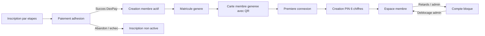

# Refonte Teranga Business Hub - Plan Par Phases

Ce document sert de tableau de suivi pour la refonte métier et fonctionnelle de l'application.

## Statuts De Suivi

- `[ ]` A faire
- `[~]` En cours
- `[x]` Termine
- `[?]` A clarifier

## Phase 1 - Cadrage Metier Final

Objectif: figer le nouveau parcours avant les changements techniques.

### Decisions Validees

- [x] L'utilisateur final devient membre uniquement apres paiement d'adhesion reussi.
- [x] Les statuts utilisateur finaux sont `actif` et `bloque`.
- [x] Le PIN remplace totalement le mot de passe.
- [x] Le matricule devient un identifiant de connexion.
- [x] Le numero de telephone WhatsApp peut aussi servir d'identifiant de connexion.
- [x] Les inscriptions abandonnees ne creent pas de membre actif.
- [x] La carte membre est generee apres paiement reussi.
- [x] Le QR code verifie la validite de la carte via une URL ou un token securise.
- [x] Le paiement d'adhesion se fait pendant l'inscription.
- [x] Le matricule est affiche apres inscription complete et figure sur la carte membre.
- [x] L'email devient optionnel.
- [x] La carte membre contient au minimum: CNI, QR code, date d'expiration.
- [x] Le numero CNI doit contenir entre 10 et 15 chiffres.
- [x] Le KYC documentaire et la photo de profil ne sont plus requis.
- [x] La carte membre est recto uniquement; le QR code est affiche sur le recto.
- [x] La verification automatique du numero de telephone est supprimee.
- [x] Le reset PIN se fait par lien unique genere depuis l'administration.

### Parcours Cible



### Points Verrouilles

- [x] Duree de validite d'une inscription temporaire non payee: `24h` par defaut via `ADHESION_APPLICATION_EXPIRATION_HOURS`.
- [x] Duree de validite de la carte membre: `1 an` apres paiement d'adhesion.
- [x] Informations publiques QR: validite, raison d'invalidite, matricule, nom, prenom, statut, date d'expiration, date d'emission.
- [x] Procedure de reset PIN: lien unique genere par admin apres verification humaine du membre.

## Phase 2 - Refonte Base De Donnees

Objectif: preparer les nouvelles donnees sans casser l'existant.

### Taches

- [x] Ajouter les champs membre:
  - `civilite`
  - `date_naissance`
  - `pays_residence`
  - `region`
  - `departement`
  - `commune`
  - `pin_hash`
  - `pin_configured_at`
  - `first_login_completed_at`
  - `card_token`
  - `card_issued_at`
- [x] Adapter la validation CNI a `10-15 chiffres`.
- [x] Rendre le mot de passe nullable ou preparer son remplacement progressif.
- [x] Migrer les statuts utilisateur vers `actif` / `bloque`.
- [x] Creer une table d'inscription temporaire, par exemple `adhesion_applications`.
- [x] Lier les paiements d'adhesion aux inscriptions temporaires.
- [x] Preparer la migration des membres existants: non applicable, demarrage base vide.

### Livrables

- [x] Migrations Laravel.
- [x] Script de migration des donnees existantes non requis.
- [x] Tests de migration remplaces par tests de migrations fraiches et suite backend.

## Phase 3 - Nouveau Processus D'Inscription Et Paiement

Objectif: remplacer l'ancien parcours `register -> validation admin -> paiement adhesion` par un parcours `inscription -> paiement adhesion -> membre actif`.

### Taches

- [x] Creer le service backend de gestion des inscriptions temporaires.
- [x] Creer le endpoint d'inscription par etapes cote front via une soumission atomique backend.
- [x] Integrer le paiement DexPay pendant l'inscription.
- [x] Adapter le webhook DexPay pour creer le membre actif apres paiement reussi.
- [x] Generer le matricule apres confirmation du paiement.
- [x] Generer la carte membre apres confirmation du paiement.
- [x] Gerer les paiements echoues ou abandonnes sans creer de membre actif.
- [x] Fermer l'ancien endpoint d'inscription membre `/api/register`.
- [x] Expirer automatiquement les inscriptions adhesion non finalisees.

### Endpoints Possibles

- [x] `POST /api/adhesion/start`
- [x] `PUT /api/adhesion/{id}/identity` non retenu: les donnees sont soumises ensemble a `POST /api/adhesion/start`.
- [x] `PUT /api/adhesion/{id}/address` non retenu: les donnees sont soumises ensemble a `POST /api/adhesion/start`.
- [x] `PUT /api/adhesion/{id}/card-info` non retenu: les donnees sont soumises ensemble a `POST /api/adhesion/start`.
- [x] `POST /api/adhesion/{id}/payment`
- [x] `GET /api/adhesion/{id}/status`

### Livrables

- [x] Services backend.
- [x] Controleurs et routes API.
- [x] Tests: inscription complete, paiement reussi, paiement echoue, abandon.

## Phase 4 - Authentification Matricule / Telephone + PIN

Objectif: remplacer email/telephone + mot de passe par matricule/telephone + PIN.

### Taches

- [x] Ajouter la connexion par champ unique `identifiant`.
- [x] Detecter automatiquement matricule ou telephone.
- [x] Ajouter la premiere connexion avec creation PIN.
- [x] Hasher le PIN en base.
- [x] Ajouter limitation de tentatives.
- [x] Ajouter reset PIN.
- [x] Bloquer la connexion si le membre a le statut `bloque`.
- [x] Supprimer les anciens endpoints publics de mot de passe; conserver le mot de passe admin pour le portail d'administration.

### Endpoints Possibles

- [x] `POST /api/auth/first-login/check`
- [x] `POST /api/auth/pin/setup`
- [x] `POST /api/login`
- [x] `POST /api/pin/forgot`
- [x] `POST /api/pin/reset`

### Livrables

- [x] Nouvelle logique d'authentification.
- [x] Guards et middlewares ajustes.
- [x] Tests auth: premiere connexion, PIN valide, PIN invalide, compte bloque, reset PIN.

## Phase 5 - Carte Membre Et QR Code

Objectif: rendre la carte membre telechargeable et verifiable.

### Taches

- [x] Generer un token de carte securise.
- [x] Ajouter le QR code sur la carte.
- [x] Ajouter la date d'expiration sur la carte.
- [x] Ajouter la CNI sur la carte.
- [x] Ajouter une route publique de verification.
- [x] Verifier la carte selon statut, token et expiration.
- [x] Prevoir une carte invalide si le membre est bloque ou expire.

### Endpoint Possible

- [x] `GET /api/member-card/verify/{token}`

### Livrables

- [x] Carte membre front telechargeable.
- [x] Verification QR publique.
- [x] Tests carte active, bloquee, expiree, token invalide.

## Phase 6 - Refonte Frontend Membre

Objectif: reconstruire l'experience membre autour du nouveau parcours.

### Ecrans A Revoir

- [x] Accueil.
- [x] Inscription par etapes.
- [x] Paiement adhesion integre.
- [x] Ecran succes avec matricule et expiration; carte disponible apres creation du PIN dans l'espace membre.
- [x] Premiere connexion.
- [x] Creation PIN.
- [x] Login matricule/telephone + PIN.
- [x] Dashboard membre.
- [x] Cotisations.
- [x] Paiement cotisation.
- [x] Carte membre.
- [x] Profil.
- [x] Notifications.
- [x] Compte bloque.

### Ecrans A Supprimer Ou Transformer

- [x] `pending-validation` supprimee.
- [x] `registration-rejected` supprimee.
- [x] Ancienne page paiement adhesion hors inscription.
- [x] Anciennes pages mot de passe transformees en parcours PIN.

### Orientation UX Mobile

- [x] Separer les pages vitrine des pages de processus.
- [x] Utiliser un layout minimal pour inscription, connexion, reset PIN et retours paiement.
- [x] Supprimer les grands visuels/sections marketing des pages fonctionnelles.
- [x] Afficher directement le formulaire ou l'action principale sur mobile.
- [x] Simplifier les en-tetes de l'espace membre sur mobile.

### Livrables

- [x] Front membre adapte.
- [x] Tests Playwright du parcours complet desktop et mobile.

## Phase 7 - Refonte Frontend Admin

Objectif: retirer les anciennes actions inutiles et renforcer le pilotage.

### A Supprimer

- [x] Validation membre.
- [x] Rejet membre.
- [x] Filtres et vues lies a `en_attente`, `attente_adhesion`, `rejete`.

### A Garder / Ameliorer

- [x] Liste membres actifs/bloques.
- [x] Blocage/deblocage.
- [x] Detail membre.
- [x] Cotisations.
- [x] Paiements.
- [x] Incidents DexPay.
- [x] Relances.
- [x] Exports CSV.
- [x] Parametres metier.
- [x] Audit admin.

### A Ajouter Eventuellement

- [x] Vue des inscriptions abandonnees ou paiements non finalises.
- [x] Vue des cartes expirees ou invalides via filtre et compteurs dans la liste membres admin.

### Livrables

- [x] Admin simplifie.
- [x] Filtres adaptes aux nouveaux statuts.
- [x] Tests admin.

## Phase 8 - Cotisations, Retards Et Blocage

Objectif: conserver la logique existante en l'alignant avec le nouveau cycle membre.

### Taches

- [x] Creer l'echeancier apres creation du membre actif.
- [x] Limiter la cotisation mensuelle configurable a `5000`, `10000`, `20000`.
- [x] Conserver le marquage des retards.
- [x] Conserver les notifications retard.
- [x] Conserver le blocage automatique sur membres actifs uniquement.
- [x] Adapter le deblocage pour repasser le membre a `actif`.

### Livrables

- [x] Services ajustes.
- [x] Tests cotisation, retard, blocage.

## Phase 9 - Migration Des Donnees Existantes

Objectif initial: ne pas perdre les membres, paiements et cotisations actuels.

### Decision

- [x] Non applicable pour cette release: demarrage avec une base vide.
- [x] Aucun script de migration membre/paiement/cotisation n'est requis.
- [x] Les anciens statuts `en_attente`, `attente_adhesion` et `rejete` ne sont pas repris.
- [x] Les migrations Laravel restent necessaires pour creer le schema de production.

### Livrables

- [x] Decision documentee: base vide.
- [x] Script de migration des donnees existantes non requis.
- [x] Rapport avant/apres non requis.
- [x] Sauvegarde prealable non requise hors procedures hebergeur.

## Phase 10 - Tests, Recette Et Deploiement

Objectif: securiser la mise en production.

### Tests Indispensables

- [x] Inscription complete + paiement DexPay simule.
- [x] Webhook paiement adhesion reussi.
- [x] Webhook paiement adhesion echoue.
- [x] Creation membre actif apres paiement reussi.
- [x] Generation matricule.
- [x] Generation carte membre.
- [x] Premiere connexion + creation PIN.
- [x] Connexion matricule + PIN.
- [x] Connexion telephone + PIN.
- [x] Paiement cotisation.
- [x] Ventilation cotisation.
- [x] QR code carte valide.
- [x] QR code carte invalide.
- [x] Blocage/deblocage.
- [x] Exports CSV admin.
- [x] Execution complete de `scripts/local-test.ps1`.
- [x] Verification Playwright membre: parcours complet desktop et mobile.
- [x] Verification Playwright admin: parcours complet desktop et mobile.
- [ ] Diagnostic production `php artisan app:diagnose-readiness --production`.
  - Execute le 2026-07-10 apres finalisation fonctionnelle: 11 erreurs, 1 avertissement en environnement local.
  - Les erreurs restantes sont des variables d'hebergement a renseigner sur Railway/Vercel/DexPay, pas du code applicatif.
  - Checklist operationnelle ajoutee dans `PRODUCTION_READINESS.md`.
  - A cocher uniquement apres execution sur l'environnement Railway production avec `0 erreur(s)`.
- [x] Diagnostic local standard `php artisan app:diagnose-readiness`.
- [x] Verification scheduler `php artisan schedule:list`.

### Recette Metier

- [x] Scenario membre complet: inscription, paiement adhesion, matricule, PIN, dashboard, carte.
- [x] Scenario admin complet: login, membres actifs/bloques, finance, relance, export CSV.
- [x] Scenario paiement echoue.
- [x] Scenario membre bloque.
- [x] Scenario QR code.
- [x] Scenario base vide: migrations fraiches puis creation du premier admin et du premier membre.

## Ordre De Realisation Recommande

1. Backend base de donnees.
2. Backend inscription payee.
3. Backend PIN/auth.
4. Backend carte QR.
5. Front membre.
6. Front admin.
7. Demarrage base vide.
8. Tests finaux et deploiement.

## Bloc Critique De La Refonte

Le bloc central a securiser en priorite est:

```text
adhesion application
  -> paiement DexPay
  -> webhook succes
  -> creation membre actif
  -> matricule
  -> carte membre
  -> premiere connexion PIN
```
